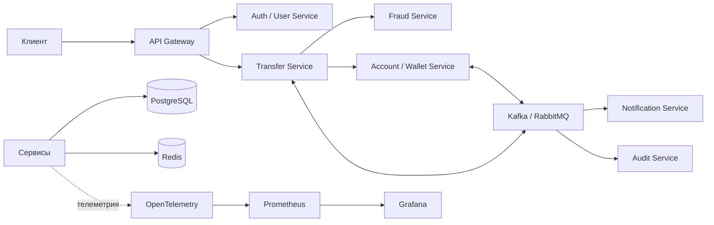

# Distributed Payment Processing System

Учебный проект распределённой платёжной системы, построенной на основе микросервисной архитектуры.

Цель проекта — самостоятельно спроектировать и реализовать систему, которая безопасно обрабатывает P2P-переводы между счетами пользователей, не допускает двойного списания, сохраняет согласованность данных при сбоях и остаётся наблюдаемой под высокой нагрузкой.

> **Текущий статус:** этап проектирования. Реализация приложения ещё не начата.

## О проекте

В итоговом виде система должна состоять из нескольких независимых сервисов. Каждый сервис будет отвечать за отдельную предметную область, владеть своими данными и взаимодействовать с остальными сервисами через API и асинхронные события.

Основное внимание в проекте будет уделено не только обычному сценарию перевода, но и сложным ситуациям:

- повторной отправке одного запроса;
- повторной доставке события;
- временной недоступности базы данных или брокера сообщений;
- остановке одного из сервисов во время обработки перевода;
- компенсации уже выполненных действий;
- восстановлению обработки после сбоя без потери перевода.

## Статус разработки

На данный момент:

- [x] сформулирована идея проекта;
- [x] определены предполагаемые сервисы и их зоны ответственности;
- [x] составлен предварительный список инфраструктурных компонентов;
- [ ] выбран окончательный технологический стек;
- [ ] спроектирована доменная модель;
- [ ] описаны API-контракты и схемы событий;
- [ ] создана структура исходного кода;
- [ ] реализованы сервисы;
- [ ] подготовлено локальное окружение;
- [ ] добавлены автоматические тесты;
- [ ] настроены мониторинг и трассировка;
- [ ] подготовлено развёртывание в Kubernetes;
- [ ] проведено нагрузочное тестирование.

Список будет обновляться по мере развития проекта. Отмеченная задача означает, что соответствующий результат действительно реализован или зафиксирован в репозитории.

## Планируемый функционал

Ниже перечислены возможности, которые планируется реализовать. В текущей версии репозитория они ещё недоступны.

### Auth / User Service

- регистрация и управление пользователями;
- аутентификация с помощью JWT;
- роли и разграничение доступа;
- авторизация запросов к API.

### Transfer Service

- создание P2P-перевода между счетами пользователей;
- получение состояния перевода;
- подтверждение или отклонение перевода;
- координация списания со счёта отправителя и зачисления на счёт получателя;
- контроль допустимых переходов между статусами.

### Account / Wallet Service

- хранение балансов;
- резервирование средств;
- списание и зачисление средств;
- журнал движения денежных средств;
- защита от двойного списания.

### Fraud Service

- базовые антифрод-проверки до списания средств;
- проверка лимитов;
- выявление подозрительно частых операций;
- возможность расширения набора правил.

### Notification Service

- уведомления об успешном переводе;
- уведомления об ошибке или отмене;
- уведомления об отклонении перевода.

### Audit Service

- история критичных действий;
- фиксация изменений статусов;
- сохранение данных для анализа спорных операций;
- поиск событий по идентификаторам перевода, счетов и трассировки.

## Предварительная архитектура



Диаграмма является предварительной и может измениться после детального проектирования.

## Планируемые механизмы надёжности

### Idempotency

Повторный запрос с одним ключом идемпотентности не должен создавать второй перевод или приводить к повторному списанию средств.

### Outbox / Inbox Pattern

Изменение бизнес-данных и создание исходящего события должны фиксироваться атомарно. Получатели событий должны распознавать повторную доставку и не применять одно событие несколько раз.

### Saga

Цепочка обработки перевода будет состоять из локальных транзакций. Если один из этапов завершится ошибкой, система должна выполнить компенсирующие действия для возврата в согласованное состояние.

### Retry и Dead Letter Queue

Для временных ошибок будет использоваться повторная обработка с задержкой. Сообщения, которые невозможно обработать после заданного количества попыток, будут помещаться в Dead Letter Queue.

### Redis

Redis планируется использовать для кеширования, ограничения частоты запросов и распределённых блокировок там, где это действительно необходимо.

## Предполагаемые технологии

Окончательный стек ещё не выбран. На данный момент рассматриваются:

| Назначение | Технология |
| --- | --- |
| Транзакционное хранилище | PostgreSQL |
| Брокер сообщений | Kafka или RabbitMQ |
| Кеш и rate limiting | Redis |
| Контейнеризация | Docker |
| Оркестрация | Kubernetes |
| Трассировка | OpenTelemetry |
| Метрики | Prometheus |
| Визуализация метрик | Grafana |

Язык программирования, фреймворк, формат API и конкретный брокер сообщений будут указаны после принятия соответствующих архитектурных решений.

## Планируемый сценарий P2P-перевода

1. Пользователь отправляет запрос на перевод средств со своего счёта на счёт другого пользователя с ключом идемпотентности.
2. API Gateway проверяет доступ и передаёт запрос в Transfer Service.
3. Transfer Service проверяет, что счета отправителя и получателя существуют, различаются и доступны для операции, после чего сохраняет перевод в начальном статусе.
4. Fraud Service выполняет антифрод-проверку.
5. Account / Wallet Service атомарно списывает средства со счёта отправителя и зачисляет их на счёт получателя либо выполняет эти действия как согласованную последовательность локальных транзакций.
6. Transfer Service фиксирует успешный результат.
7. Notification Service отправляет уведомления участникам перевода.
8. Audit Service сохраняет историю операции.
9. При ошибке Saga запускает необходимые компенсирующие действия, чтобы восстановить балансы и согласованное состояние перевода.

Точный сценарий, статусы и правила переходов будут определены до начала реализации Transfer Service.

## Запуск проекта

Проект пока нельзя запустить: исходный код, конфигурация и контейнеры ещё не созданы.

После появления первой рабочей версии здесь будут опубликованы:

- системные требования;
- необходимые зависимости и их версии;
- пример файла переменных окружения;
- инструкция по первичной настройке;
- команды локального запуска;
- команды запуска через Docker Compose;
- способ применения миграций базы данных;
- адреса API, Swagger/OpenAPI и интерфейсов мониторинга;
- инструкция по остановке и очистке локального окружения.

В README не будут добавляться неподтверждённые команды запуска. Каждая опубликованная инструкция должна быть проверена на актуальной версии проекта.

## Конфигурация

Переменные окружения ещё не определены. Когда они появятся, репозиторий будет содержать безопасный пример конфигурации, например `.env.example`, без паролей, токенов и других секретов.

Предполагаемые группы настроек:

- подключения к PostgreSQL;
- подключения к Kafka или RabbitMQ;
- подключения к Redis;
- параметры JWT;
- тайм-ауты и retry-политики;
- адреса внутренних сервисов;
- настройки логирования, метрик и трассировки.

## API

API ещё не реализовано. Планируется описывать внешние контракты с помощью OpenAPI и поддерживать документацию в актуальном состоянии вместе с кодом.

Для изменяющих состояние запросов предполагается поддержка заголовка идемпотентности, например:

```http
Idempotency-Key: <unique-operation-key>
```

Точные маршруты, форматы запросов, ответы и коды ошибок будут добавлены после проектирования контрактов.

## Тестирование

Тесты ещё не реализованы. В проекте планируются:

- **unit-тесты** — бизнес-правила и переходы статусов;
- **integration-тесты** — взаимодействие с PostgreSQL, Redis и брокером сообщений;
- **contract-тесты** — совместимость API и событий разных сервисов;
- **end-to-end-тесты** — полный путь перевода, его отклонения и компенсации;
- **load-тесты** — обработка тысяч одновременных переводов;
- **failure-тесты** — поведение системы при сбоях инфраструктуры и сервисов.

Отдельно будут проверяться следующие ситуации:

- брокер сообщений недоступен после сохранения перевода;
- одно событие доставлено несколько раз;
- ответ потерян после успешного списания;
- сервис остановлен во время выполнения Saga;
- база данных временно недоступна;
- сообщение исчерпало все попытки обработки и попало в DLQ.

## Наблюдаемость

Планируется добавить:

- health checks для сервисов и их зависимостей;
- структурированные логи;
- единый correlation ID / trace ID;
- распределённую трассировку через OpenTelemetry;
- метрики latency, количества ошибок и нагрузки;
- мониторинг очередей, повторных попыток и DLQ;
- дашборды в Grafana.

Чувствительные данные, токены и платёжные реквизиты не должны попадать в логи, события и трассировки.

## Развёртывание

Развёртывание ещё не настроено. В дальнейшем планируется использовать:

- Docker для сборки и локального запуска сервисов;
- Docker Compose для локального окружения;
- Kubernetes для оркестрации и масштабирования;
- readiness- и liveness-проверки;
- безопасное хранение конфигурации и секретов;
- независимые миграции данных для каждого сервиса.

## План разработки

1. Выбрать основной язык, фреймворк и брокер сообщений.
2. Описать требования, доменные сущности и границы сервисов.
3. Спроектировать статусы перевода и допустимые переходы.
4. Зафиксировать API-контракты и схемы событий.
5. Создать структуру репозитория и локальное окружение.
6. Реализовать базовые версии Auth, Transfer и Wallet Service.
7. Добавить Fraud, Notification и Audit Service.
8. Реализовать идемпотентность и Outbox / Inbox Pattern.
9. Добавить Saga, retry-политику и Dead Letter Queue.
10. Подключить наблюдаемость и health checks.
11. Покрыть систему автоматическими тестами.
12. Подготовить Kubernetes-конфигурацию.
13. Провести нагрузочные испытания и тестирование отказов.

Порядок этапов может корректироваться по мере появления новых требований и результатов прототипирования.

## Использование искусственного интеллекта

Весь программный код проекта автор пишет самостоятельно вручную.

Искусственный интеллект используется только как вспомогательный инструмент при работе с документацией:

- автор самостоятельно определяет требования и содержание документов;
- автор даёт ИИ конкретные команды по структуре и оформлению текста;
- ИИ помогает форматировать документацию и улучшать её читаемость;
- автор обсуждает с ИИ возможные варианты оформления и принимает итоговые решения самостоятельно;
- автор проверяет и утверждает каждое изменение документации.

ИИ не является автором программной реализации и не заменяет самостоятельное проектирование и написание кода.

## Основные принципы

1. Принятый перевод не должен потеряться.
2. Повторный запрос не должен приводить к двойному списанию.
3. Каждое критичное изменение должно быть доступно для аудита.
4. Сбой отдельного компонента не должен нарушать целостность финансовых данных.
5. Состояние каждой операции должно быть наблюдаемым и объяснимым.
6. Документация должна описывать фактическое состояние проекта, а не выдавать планы за готовую реализацию.

## Лицензия

Лицензия пока не выбрана.
